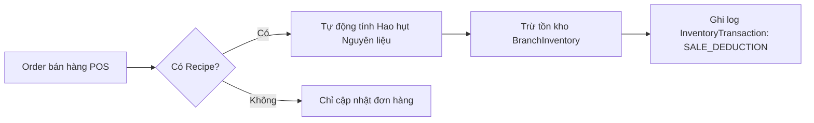

# ☕ Hậu Lê Coffee POS - Web POS & Mobile Application

Tài liệu chi tiết về hệ thống **Quản lý Bán hàng tại quầy (POS) & Quản lý Kho chi nhánh** dành cho chuỗi **Hậu Lê Coffee**, bao gồm cả phiên bản **Web POS** (`client/src/app/pos`) và ứng dụng di động **Mobile POS App** (`pos-app`).

[](https://expo.dev/)
[](https://reactnative.dev/)
[](https://nextjs.org/)
[](https://expressjs.com/)
[](https://www.prisma.io/)

---

## 📋 Mục lục
- [📝 Tổng quan Hệ thống POS](#-tổng-quan-hệ-thống-pos)
- [🖥️ 1. Giao diện Web POS (`client/src/app/pos`)](#️-1-giao-diện-web-pos-clientsrcapppos)
- [📱 2. Ứng dụng Di động POS (`pos-app`)](#-2-ứng-dụng-di-động-pos-pos-app)
- [📦 3. Hệ thống Quản lý Kho Chi nhánh & Định lượng (POS Inventory)](#-3-hệ-thống-quản-lý-kho-chi-nhánh--định-lượng-pos-inventory)
- [📊 4. Thống kê & Báo cáo Doanh thu](#-4-thống-kê--báo-cáo-doanh-thu)
- [🛠️ Công nghệ Sử dụng](#️-công-nghệ-sử-dụng)
- [📂 Cấu trúc Thư mục POS](#-cấu-trúc-thư-mục-pos)
- [🚀 Hướng dẫn Cài đặt & Khởi chạy](#-hướng-dẫn-cài-đặt--khởi-chạy)
- [🔌 API Endpoints POS & Inventory](#-api-endpoints-pos--inventory)

---

## 📝 Tổng quan Hệ thống POS

Hệ thống **Hậu Lê Coffee POS** là giải pháp quản lý bán hàng đa nền tảng tối ưu cho các chi nhánh quán cafe và đồ uống. Hệ thống phục vụ 2 môi trường làm việc chính:

1. **Web POS (Thu ngân & Quản lý chi nhánh tại quầy)**:
   - Chạy trực tiếp trên trình duyệt Web (`http://localhost:3000/pos`).
   - Thao tác màn hình rộng, tối ưu cho máy tính thu ngân, máy POS cố định tại quầy.
   - Tích hợp đầy đủ Dashboard quản lý kho chi nhánh, định lượng công thức, quản lý bàn và thanh toán.

2. **Mobile POS App (Nhân viên order di động tại bàn)**:
   - Phát triển bằng **Expo 54** và **React Native 0.81**, chạy mượt mà trên iOS, Android và Web.
   - Giúp nhân viên phục vụ xem sơ đồ bàn, di chuyển gọi món trực tiếp tại bàn khách, ghi chú tùy chỉnh món và gửi order xuống bếp/quầy pha chế tức thì.

---

## 🖥️ 1. Giao diện Web POS (`client/src/app/pos`)

Giao diện Web POS được chia làm 2 khu vực chính:

### A. Màn hình Bán hàng & Thu ngân (`/pos`)
- **Đăng nhập & Chọn Chi nhánh**: Nhân viên / Quản lý đăng nhập và chọn chi nhánh làm việc tương ứng (`branchId`).
- **Sơ đồ Bàn thời gian thực (Table Map)**:
  - Hiển thị danh sách bàn theo trạng thái màu sắc sinh động:
    - ⚪ `EMPTY`: Bàn trống, sẵn sàng đón khách.
    - 🟤 `SERVING`: Bàn đang có khách dùng dịch vụ.
    - 🟠 `WAITING_PAYMENT`: Bàn đang đợi thanh toán.
  - **Bộ đếm thời gian ngồi (`TableTimer`)**: Tính chính xác số phút/giờ khách đã ngồi kể từ lúc mở bàn.
- **Thao tác Gọi món & Ghi chú (Modifiers)**:
  - Chọn sản phẩm từ danh mục (Cà phê, Trà sữa, Bánh ngọt...).
  - Thêm ghi chú cho từng món: *ví dụ: 50% đường, ít đá, không sữa, thêm topping...*
  - Điều chỉnh số lượng hoặc xóa món khỏi order dễ dàng.
- **Thanh toán & In Hóa đơn**:
  - Hỗ trợ 4 phương thức thanh toán: Tiền mặt (`CASH`), Chuyển khoản (`BANK_TRANSFER`), Ví điện tử (`E_WALLET`), Thẻ (`CARD`).
  - Tự động hoàn tất order, trừ kho nguyên liệu và cập nhật bàn về trạng thái `EMPTY`.

### B. Màn hình Quản trị POS Chi nhánh (`/pos/admin`)
- Xem tổng quan doanh thu chi nhánh, top sản phẩm bán chạy, tỷ trọng phương thức thanh toán.
- Truy cập tệp quản lý kho chi nhánh chi tiết ([InventoryTab.tsx](file:///c:/Users/THINKPAD/Documents/cafe%20h%E1%BA%ADu%20l%C3%AA/MIS_HASAKI/client/src/app/pos/admin/InventoryTab.tsx)).

---

## 📱 2. Ứng dụng Di động POS (`pos-app`)

Ứng dụng di động được thiết kế giao diện tối ưu cho màn hình cảm ứng điện thoại & máy tính bảng với các Tab chính:

1. **Tab Sơ đồ bàn (`(tabs)/index.tsx`)**:
   - Xem danh sách bàn dạng Grid trực quan.
   - Thao tác 1-chạm để mở bàn, xem chi tiết hóa đơn hoặc tiến hành gọi món.
   - Badge hiển thị thời gian khách ngồi theo thời gian thực.
2. **Tab Menu sản phẩm (`(tabs)/menu.tsx`)**:
   - Duyệt nhanh toàn bộ menu đồ uống theo danh mục.
   - Tìm kiếm món ăn/uống theo tên từ khóa.
3. **Tab Báo cáo Doanh thu (`(tabs)/explore.tsx`)**:
   - Xem tổng doanh thu trong ngày/tuần/tháng của chi nhánh.
   - Thống kê biểu đồ thanh toán và danh sách hóa đơn gần đây.
4. **Tab Quản lý Kho di động (`(tabs)/inventory.tsx`)**:
   - Tra cứu nhanh số lượng tồn kho nguyên liệu & sản phẩm tại chi nhánh.
   - Cảnh báo các nguyên liệu dưới định mức tồn kho an toàn (`minStock`).
   - Lập phiếu nhập/xuất kho trực tiếp trên điện thoại.

---

## 📦 3. Hệ thống Quản lý Kho Chi nhánh & Định lượng (POS Inventory)

Hệ thống POS bao gồm engine quản lý kho toàn diện được tích hợp trực tiếp với cơ sở dữ liệu:



### Các thành phần chính của POS Inventory:
1. **Nguyên liệu & Vật tư (`Ingredient`)**:
   - Quản lý danh mục nguyên liệu pha chế (Cà phê hạt, Sữa tươi, Sữa đặc, Syrup, Ly nhựa...).
   - Đơn vị tính đa dạng (g, ml, hộp, cái, kg...) và giá vốn nhập kho trung bình (`costPrice`).
2. **Định lượng Công thức (`ProductRecipe`)**:
   - Cấu hình số lượng nguyên liệu tiêu hao cho 1 đơn vị sản phẩm bán lẻ (VD: 1 ly *Cà phê sữa đá* tiêu hao 15g Cà phê hạt + 30ml Sữa đặc + 1 Ly nhựa).
3. **Tồn kho Chi nhánh (`BranchInventory`)**:
   - Theo dõi tồn kho thực tế của cả Nguyên liệu và Sản phẩm bán lẻ tại từng chi nhánh.
   - Cài đặt định mức tồn tối thiểu (`minStock`) để cảnh báo nhập hàng kịp thời.
4. **Tự động Trừ Kho (`SALE_DEDUCTION`)**:
   - Ngay khi thu ngân hoàn tất thanh toán hóa đơn POS, hệ thống tự động tra cứu công thức pha chế và trừ lùi số lượng nguyên liệu tương ứng trong kho chi nhánh.
5. **Phiếu Giao dịch Kho (`InventoryTransaction`)**:
   - **Nhập kho (`IMPORT`)**: Nhập hàng từ nhà cung cấp kèm đơn giá.
   - **Xuất kho (`EXPORT`)**: Xuất trả, hủy hàng hỏng hoặc hết hạn.
   - **Điều chuyển (`TRANSFER_IN` / `TRANSFER_OUT`)**: Điều chuyển nguyên liệu giữa các chi nhánh.
6. **Kiểm kê Kho & Điều chỉnh (`InventoryAudit`)**:
   - Nhân viên kiểm đếm số lượng thực tế tại kho.
   - Hệ thống tính toán chênh lệch (`discrepancy = actualQty - systemQty`).
   - Quản lý phê duyệt và thực hiện điều chỉnh cân bằng kho tự động (`AUDIT_ADJUST`).
7. **Nhà cung cấp (`Supplier`)**:
   - Quản lý danh bạ nhà cung cấp nguyên vật liệu.

---

## 📊 4. Thống kê & Báo cáo Doanh thu

Hệ thống cung cấp bộ công cụ phân tích tình hình kinh doanh cho từng chi nhánh:
- **Doanh thu theo thời gian**: Hôm nay, Tuần này, Tháng này, Quý này hoặc Khoảng ngày tùy chọn.
- **Phân tích Phương thức Thanh toán**: Tỷ lệ % giao dịch qua Tiền mặt, Chuyển khoản, Ví điện tử và Thẻ bank.
- **Top Sản phẩm Bán chạy**: Danh sách các món nước và đồ ăn được gọi nhiều nhất trong kỳ.
- **Nhật ký Hóa đơn**: Lịch sử chi tiết từng hóa đơn, người tạo, thời gian và phương thức thanh toán.

---

## 🛠️ Công nghệ Sử dụng

### Client Web POS (`client`)
- **Next.js 15** (App Router), **React 19**
- **Tailwind CSS** & **Framer Motion**
- **Lucide Icons**

### Mobile App (`pos-app`)
- **Expo SDK 54** & **React Native 0.81**
- **Expo Router v6** (File-based Routing)
- **Lucide React Native**
- **React Native Reanimated v4**
- **AsyncStorage** (`@react-native-async-storage/async-storage`)

### Backend Server (`server`)
- **Express.js 4.21** & **TypeScript 5.8**
- **Prisma ORM 6.19** & **PostgreSQL**
- **JWT Authentication** & **Role Authorization** (`STAFF`, `ADMIN`)

---

## 📂 Cấu trúc Thư mục POS

```text
mis-hasaki/
├── client/src/app/pos/
│   ├── page.tsx                # Giao diện Web POS Bán hàng & Thu ngân
│   ├── login/                  # Màn hình Đăng nhập Web POS
│   └── admin/
│       ├── page.tsx            # Dashboard Báo cáo Doanh thu Web POS
│       ├── layout.tsx          # Layout Quản trị POS
│       └── InventoryTab.tsx    # Giao diện Quản lý Kho & Định lượng Web POS
│
├── pos-app/                    # Ứng dụng Di động POS Expo
│   ├── src/
│   │   ├── app/
│   │   │   ├── (auth)/login.tsx    # Đăng nhập nhân viên trên Mobile
│   │   │   ├── (tabs)/
│   │   │   │   ├── index.tsx       # Sơ đồ bàn & Trạng thái thời gian thực
│   │   │   │   ├── menu.tsx        # Danh mục thực đơn & Gọi món
│   │   │   │   ├── explore.tsx     # Báo cáo doanh thu mobile
│   │   │   │   └── inventory.tsx   # Quản lý kho chi nhánh di động
│   │   │   └── order/[tableId].tsx # Chi tiết màn hình gọi món theo bàn
│   │   ├── components/
│   │   │   ├── TableTimer.tsx      # Bộ đếm thời gian ngồi của khách
│   │   │   └── ...
│   │   └── lib/
│   │       ├── api.ts              # Mobile API Client & JWT Auth Headers
│   │       └── storage.ts          # AsyncStorage helper
│   ├── app.json
│   └── package.json
│
└── server/src/
    ├── controllers/
    │   ├── pos-auth.controller.ts
    │   ├── pos-table.controller.ts
    │   ├── pos-order.controller.ts
    │   ├── pos-analytics.controller.ts
    │   └── pos-inventory.controller.ts # Controller xử lý Kho, Recipe, Audit
    └── routes/
        ├── pos-auth.routes.ts
        ├── pos-table.routes.ts
        ├── pos-order.routes.ts
        ├── pos-analytics.routes.ts
        └── pos-inventory.routes.ts
```

---

## 🚀 Hướng dẫn Cài đặt & Khởi chạy

### Yêu cầu Chuẩn bị
- Node.js `>= 18.0.0`
- npm `>= 9.0.0`
- Backend API Server đã khởi chạy tại `http://localhost:4000` (xem [README chính](file:///c:/Users/THINKPAD/Documents/cafe%20h%E1%BA%ADu%20l%C3%AA/MIS_HASAKI/README.md))

---

### A. Khởi chạy Web POS (`client`)

Từ thư mục gốc dự án:
```bash
npm run dev:client
```
- Truy cập Web POS tại: [http://localhost:3000/pos](http://localhost:3000/pos)
- Truy cập Admin POS Kho tại: [http://localhost:3000/pos/admin](http://localhost:3000/pos/admin)

---

### B. Khởi chạy Mobile POS App (`pos-app`)

1. **Di chuyển vào thư mục `pos-app`**:
   ```bash
   cd pos-app
   ```

2. **Cài đặt các gói phụ thuộc**:
   ```bash
   npm install
   ```

3. **Cấu hình API Endpoint**:
   Mở file [api.ts](file:///c:/Users/THINKPAD/Documents/cafe%20h%E1%BA%ADu%20l%C3%AA/MIS_HASAKI/pos-app/src/lib/api.ts) và cập nhật đường dẫn server:
   ```typescript
   export const DEFAULT_API_URL = 'http://192.168.x.x:4000'; // Điền IP máy tính chạy server nếu test thiết bị thật
   ```

4. **Chạy Expo Dev Server**:
   ```bash
   npm run start
   ```

5. **Chạy ứng dụng**:
   - **Trên điện thoại**: Mở app **Expo Go** trên Android/iOS và quét mã QR.
   - **Trên trình duyệt Web**: Nhấn phím `w` trong terminal.
   - **Trên giả lập Android**: Nhấn phím `a` trong terminal.

---

## 🔌 API Endpoints POS & Inventory

Tất cả các Endpoint POS yêu cầu Header xác thực `Authorization: Bearer <token>` và `x-branch-id: <branchId>`.

| Phương thức | Endpoint | Mô tả |
| :--- | :--- | :--- |
| `POST` | `/api/pos/auth/login` | Đăng nhập nhân viên POS |
| `GET` | `/api/pos/tables` | Lấy danh sách bàn & trạng thái |
| `POST` | `/api/pos/orders` | Tạo đơn hàng POS mới |
| `POST` | `/api/pos/orders/:id/pay` | Thanh toán đơn hàng & tự động trừ kho nguyên liệu |
| `GET` | `/api/pos/analytics` | Thống kê doanh thu & báo cáo chi nhánh |
| `GET` | `/api/pos/inventory/ingredients` | Quản lý danh mục nguyên liệu |
| `GET` | `/api/pos/inventory/recipes/product/:productId` | Lấy công thức định lượng sản phẩm |
| `POST` | `/api/pos/inventory/recipes/product/:productId` | Cập nhật công thức định lượng |
| `GET` | `/api/pos/inventory/branch-stock` | Tra cứu tồn kho nguyên liệu & sản phẩm chi nhánh |
| `POST` | `/api/pos/inventory/transactions/import` | Lập phiếu nhập kho nguyên liệu |
| `POST` | `/api/pos/inventory/transactions/export` | Lập phiếu xuất kho hỏng / hao hụt |
| `GET` | `/api/pos/inventory/audits` | Lấy danh sách phiếu kiểm kê kho |
| `POST` | `/api/pos/inventory/audits` | Tạo phiếu kiểm kê kho mới |
| `POST` | `/api/pos/inventory/audits/:id/adjust` | Phê duyệt & điều chỉnh chênh lệch kho |
| `GET` | `/api/pos/inventory/suppliers` | Danh sách nhà cung cấp |

---

*Để xem tài liệu tổng quan toàn bộ hệ thống Monorepo (bao gồm Hasaki E-commerce & BI Analytics), vui lòng tham khảo [README.md gốc của dự án](file:///c:/Users/THINKPAD/Documents/cafe%20h%E1%BA%ADu%20l%C3%AA/MIS_HASAKI/README.md).*
